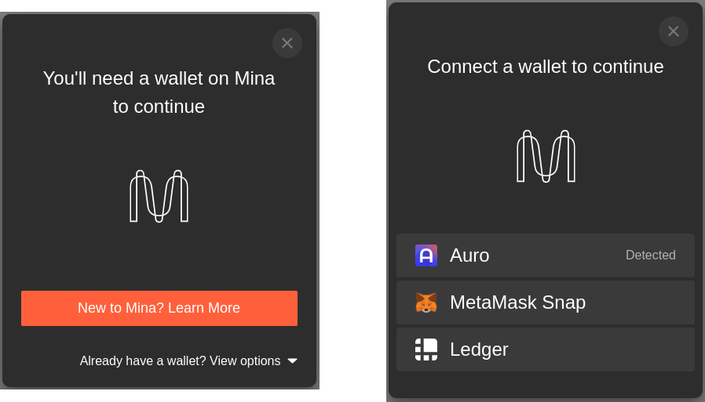

# Mina Wallet Adapter

Modular TypeScript wallet adapters and components designed for Mina zkApps. Add wallet support into your zkApp with just a few lines of code.

## Demo

Check out the demo sites below to see the Wallet Adapter in action.

👉 [zkApp Starter Kit](https://aztemi.github.io/mina-wallet-adapter/)

## Core Features

- [Wallet Standard](https://github.com/wallet-standard/wallet-standard) support
- Auto-detection of installed wallets
- Automatic wallet state management
- Integration with .mina domain (Mina Names Service)
- Query hooks and modular UI components for zkApps
- TypeScript

## Documentation

[https://aztemi.github.io/mina-wallet-adapter/](https://aztemi.github.io/mina-wallet-adapter/)

## Directory Structure

This is a monorepo containing the following packages.

- `site`: Project website with the documentations and guidelines
- `packages`
  - `core`: Base library containing shared interfaces, classes and common logics
  - `wallets`: Adapter class library for `Wallet Standard` and wrapper classes for legacy wallets like Auro Wallet
  - `ui`: UI components and hooks for zkApps, supporting `Vanilla JS`, `Svelte`, `React`, `Vue`, and `Angular` frameworks
  - `starter`: Reference starter templates showing how to use the Wallet Adapter in zkApps
    - `svelte`: Starter zkApp example using `SvelteKit`
    - `react`: Starter zkApp example in React created with `Create React App`
    - `contract`: Shared o1js smart contract used in above JS starter examples

> _Vanilla js, Vue and Angular components are WIP_

## Architecture

## License

[Apache-2.0](./LICENSE)
