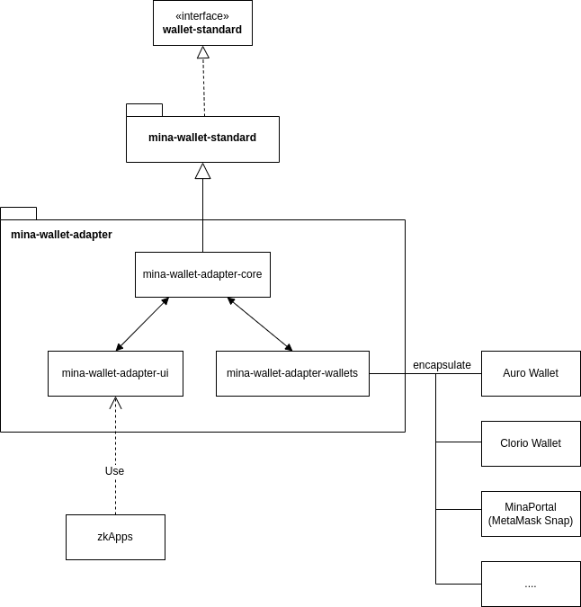

# Mina Wallet Adapter

Modular TypeScript wallet adapters and components designed for Mina zkApps. Add wallet support into your zkApp with just a few lines of code.

## Features

- Wallet Standard support
- Auto-detection of installed wallets
- TypeScript
- Modular UI components for zkApps

## Architecture

